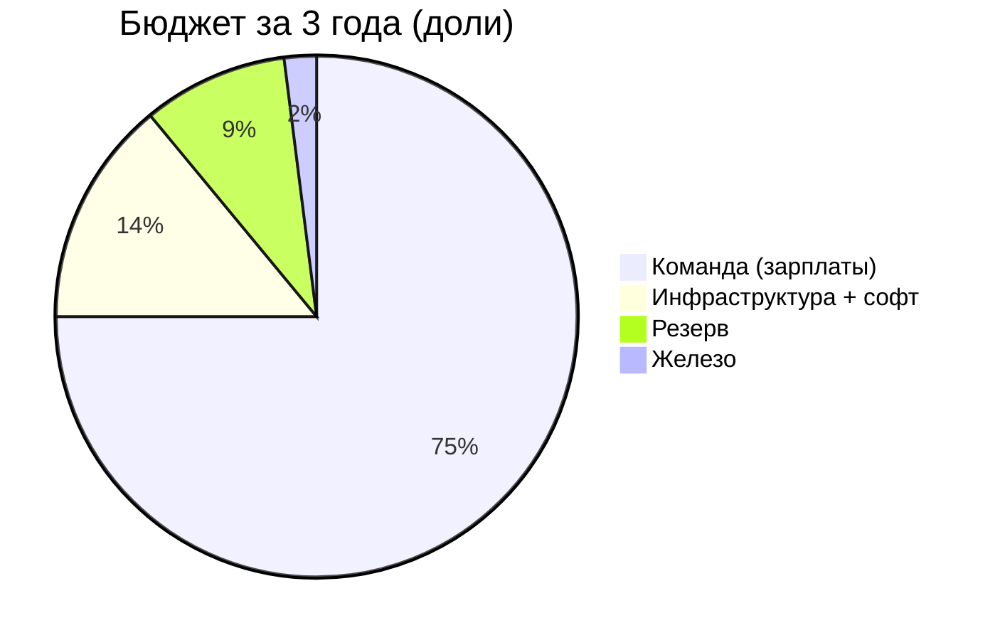

# TOTAL — Стоимость разработки B2B платформы 
---

## Что разрабатываем

**Полноценную B2B платформу:**
- 🌐 **Веб-приложение** (React + TypeScript)
- 📱 **Мобильное приложение** (iOS + Android)
- ⚙️ **Backend API** (Node.js/Express)
- 🗄️ **База данных** (MongoDB)

---

## Команда (3 разработчика + поддержка)

### Первый год (разработка):
- **Fullstack разработчик** — ₽350k/мес
- **Frontend разработчик** — ₽300k/мес  
- **Backend разработчик** — ₽350k/мес
- **Тестировщик (QA)** — 0.5 ставки — ₽125k/мес
- **DevOps** — 0.3 ставки — ₽120k/мес

**Итого зарплаты:** ₽1.245M/мес  
**С налогами (+30%):** ₽1.619M/мес  
**За 12 месяцев:** ≈ **₽19.4M**

### Второй и третий год (поддержка):
- **Frontend разработчик** — 0.5 ставки — ₽150k/мес
- **Backend разработчик** — 0.5 ставки — ₽175k/мес
- **DevOps/Тестировщик** — 0.3 ставки — ₽100k/мес

**Итого зарплаты:** ₽425k/мес  
**С налогами (+30%):** ₽553k/мес  
**За 12 месяцев:** ≈ **₽6.6M/год**

---

## Железо и оборудование

### Разовая закупка (начало):
- 3 ноутбука разработчикам (MacBook/мощный ПК) — ₽150k × 3 = **₽450k**
- Тестовые устройства (2 телефона iOS/Android) — **₽150k**

**Итого железо:** ≈ **₽600k** (разово)

---

## Инфраструктура и софт

### Первый год (разработка + prod):
**Ежемесячно:**
- Облако (серверы для прода + тест) — ₽80k
- MongoDB (база данных) — ₽40k
- CI/CD, мониторинг, логи — ₽30k
- GitHub, Jira, Figma, Sentry — ₽50k

**Итого:** ₽200k/мес × 12 = **₽2.4M**

### Второй и третий год (prod + поддержка):
**Ежемесячно:**
- Облако (production) — ₽60k
- MongoDB — ₽40k
- Мониторинг + логи — ₽20k
- Софт (GitHub, Jira и т.д.) — ₽40k

**Итого:** ₽160k/мес × 12 = **₽1.92M/год**

---

## Итоговая стоимость на 3 года

```
┌─────────────────────────────────────────────────────────┐
│                    ГОД 1 (разработка)                   │
├─────────────────────────────────────────────────────────┤
│ Команда (3 разработчика + QA + DevOps)  ₽19.4M         │
│ Железо (ноутбуки + устройства)           ₽0.6M         │
│ Инфраструктура + софт                     ₽2.4M         │
│ Резерв на непредвиденное (10%)            ₽2.2M         │
├─────────────────────────────────────────────────────────┤
│ ИТОГО ГОД 1:                            ₽24.6M          │
└─────────────────────────────────────────────────────────┘

┌─────────────────────────────────────────────────────────┐
│                 ГОД 2 (поддержка)                       │
├─────────────────────────────────────────────────────────┤
│ Команда (сниженная загрузка)              ₽6.6M         │
│ Инфраструктура + софт                     ₽1.92M        │
│ Резерв (10%)                              ₽0.85M        │
├─────────────────────────────────────────────────────────┤
│ ИТОГО ГОД 2:                             ₽9.4M          │
└─────────────────────────────────────────────────────────┘

┌─────────────────────────────────────────────────────────┐
│                 ГОД 3 (поддержка)                       │
├─────────────────────────────────────────────────────────┤
│ Команда (сниженная загрузка)              ₽6.6M         │
│ Инфраструктура + софт                     ₽1.92M        │
│ Резерв (10%)                              ₽0.85M        │
├─────────────────────────────────────────────────────────┤
│ ИТОГО ГОД 3:                             ₽9.4M          │
└─────────────────────────────────────────────────────────┘

╔═════════════════════════════════════════════════════════╗
║           ИТОГО ЗА 3 ГОДА:  ₽43.4M                      ║
╚═════════════════════════════════════════════════════════╝
```

---

## Разбивка по годам (наглядно)

| Статья расходов          | Год 1    | Год 2   | Год 3   | Всего   |
|--------------------------|----------|---------|---------|---------|
| **Команда**              | ₽19.4M   | ₽6.6M   | ₽6.6M   | ₽32.6M  |
| **Железо**               | ₽0.6M    | —       | —       | ₽0.6M   |
| **Инфра + софт**         | ₽2.4M    | ₽1.92M  | ₽1.92M  | ₽6.24M  |
| **Резерв (10%)**         | ₽2.2M    | ₽0.85M  | ₽0.85M  | ₽3.9M   |
| **ИТОГО:**               | **₽24.6M** | **₽9.4M** | **₽9.4M** | **₽43.4M** |

---

## График распределения бюджета



---

## Сроки разработки

### Первый год — полная разработка:
- **Месяцы 1-3:** Веб-приложение (MVP)
- **Месяцы 4-6:** Backend API + база данных
- **Месяцы 7-10:** Мобильное приложение (iOS + Android)
- **Месяцы 11-12:** Тестирование, доработки, запуск

### Второй и третий год:
- Поддержка, исправление багов
- Мелкие доработки и новые фичи
- Обновление зависимостей

---

## Что входит в разработку

### Веб-приложение:
- Регистрация и авторизация
- Профиль компании (4 вкладки)
- Поиск партнеров с фильтрами
- Сообщения между компаниями
- Отзывы и рейтинги
- Массовые запросы
- Личный кабинет

### Мобильное приложение:
- Все функции веб-версии
- Push-уведомления
- Оптимизация под телефоны

### Backend:
- REST API для всех операций
- Аутентификация (JWT)
- Загрузка файлов
- Email-рассылки
- Интеграция с ФНС (проверка ИНН)

### База данных:
- MongoDB с индексами
- Backup и репликация
- Миграции данных

---

## Главное коротко

💰 **Сколько стоит:** ₽43.4M за 3 года  
⏱️ **Сколько времени:** 12 месяцев до запуска  
👥 **Сколько людей:** 3 разработчика + QA + DevOps  
📦 **Что получаем:** Веб + Мобилка + Backend + База  

**Первый год самый дорогой** (₽24.6M) — вся разработка.  
**Второй и третий год дешевле** (по ₽9.4M) — только поддержка.


